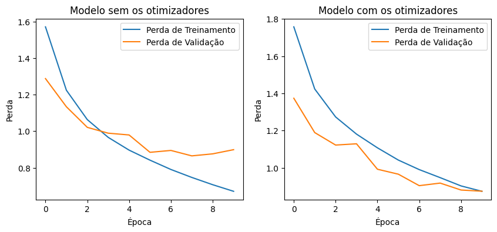
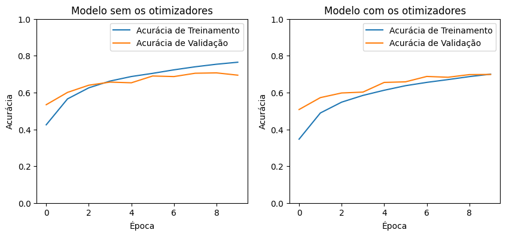

# Relatório de Modelo com Cifar-10

O seguinte relatório tem como propósito descrever a configuração do Modelo e as técnicas de Otimização com suas abordagens. Além disso, será dado configurações para funcionamento da api do Modelo, casos de teste do Modelo que usou a tarefa de classificação, e por fim análise e discussão por meio de resultados gráficos sobre a performance e desempenho do modelo antes e depois da otimização;

## Configurações do Modelo

Nesta seção serão abordadas as configurações referentes a arquitetura e hiperparâmetros:

**Arquitetura:**

A arquitetura do modelo é uma rede neural convolucional (CNN) composta por:

- Três camadas de convolução (Conv2D) com funções de ativação ReLU, intercaladas com camadas de pooling máximo (MaxPooling2D).

- Uma camada de Flatten para transformar a matriz em um vetor.

- Duas camadas densas (Dense), uma com 64 neurônios e ativação ReLU, e a última com 10 neurônios correspondentes às classes do CIFAR-10.

- Uma camada de dropout com taxa de 0.5 para reduzir o overfitting.

Esta estrutura permite a extração de características relevantes das imagens e a classificação correta nas 10 categorias do dataset CIFAR-10.

**Hiperparâmetros**

- Otimizador: Adam

Um algoritmo popular de otimização que ajusta os pesos da rede neural durante o treinamento com base nos gradientes das perdas.
Usa uma taxa de aprendizado padrão de 0.001 e parâmetros de decaimento exponencial (Beta1 e Beta2) para momentos estimados dos gradientes.

- Função de Perda: SparseCategoricalCrossentropy

Uma função de perda adequada para problemas de classificação multiclasse com labels inteiras.

- Métricas: Accuracy

Uma métrica comum para problemas de classificação que mede a proporção de previsões corretas.

- Número de Épocas: 10

O número de vezes que o modelo passará por todo o conjunto de treinamento durante o treinamento.

- Tamanho do Lote: 64

O número de amostras de treinamento que serão propagadas através da rede antes de atualizar os parâmetros do modelo.

**Dataset Cifar-10**

O CIFAR-10 é um conjunto de dados amplamente utilizado na área de visão computacional e aprendizado de máquina. Consiste em 60.000 imagens coloridas de dimensões 32x32 pixels, divididas em 10 classes diferentes, cada uma representando uma categoria de objeto. As categorias são as seguintes:

- Avião (categoria 0);
- Automóvel (categoria 1);
- Pássaro (categoria 2);
- Gato (categoria 3);
- Cervo (categoria 4);
- Cachorro (categoria 5);
- Sapo (categoria 6);
- Cavalo (categoria 7);
- Navio (categoria 8);
- Caminhão (categoria 9);

## Técnicas de Otimização

Nesta seção serão abordadas as técnicas de otimização seguindo as abordagens "De dentro pra fora" e de "De fora pra dentro", respectivamente:

### De dentro pra fora

**Early Stopping:**

- É criado um callback **EarlyStopping** para interromper o treinamento prematuramente se não houver melhora na perda de validação;

- O parâmetro **monitor='val_loss'** especifica a métrica a ser monitorada, neste caso, a perda de validação;

- O parâmetro **patience=2** define o número de épocas a serem esperadas após a parada do treinamento se não houver melhora;

- O parâmetro **restore_best_weights=True** indica que os pesos do modelo devem ser restaurados para os melhores pesos após a parada;

- O parâmetro **start_from_epoch=2** especifica a época a partir da qual começar a monitorar a paciência;

**Modelo com Dropout:**

- O modelo sequencial é configurado com camadas convolucionais, camadas de pooling e camadas densas;
- Uma camada de Dropout com uma taxa de **0.5** é adicionada para reduzir o overfitting;

### De fora pra dentro

**Quantização:**

- O modelo Keras é convertido para o formato TensorFlow Lite;
- São aplicadas otimizações de quantização durante a conversão para reduzir o tamanho do modelo;
- Um interpretador TensorFlow Lite é criado com o modelo quantizado, e tensores são alocados para ele;

## API do Modelo

Instruções para o funcionamento da api:

- Instale as bibliotecas abaixo:

```
pip install Flask tensorflow numpy Pillow
```

- Rode o arquivo **api.py**:

```
python api.py
```

A rota da api contém apenas o método **POST** que recebe no body um **file** e o valor deste parâmetro é uma imagem 32x32 com o formato **png** que siga as categorias do Cifar-10. Logo abaixo, haverá um link de uma documentação com três casos de teste feito no **Postman**:

- Link da rota: http://127.0.0.1:5000/predict

- Link do documento do Postman (três casos de teste, e as categorias correspondentes estão na seção "Dataset Cifar-10"): https://documenter.getpostman.com/view/20681700/2sA3Qwcpwb

## Casos de Teste

Foram feitos três casos de teste diante da performance do Modelo referente a tarefa de classificação, e estes testes foram experimentados por meio da api e estão dentro da documentação do Postman:

**Caso de teste com a image_0.png:**


- Expectativa da resposta: categoria 3 (Gato);
- Predição do modelo: categoria 3 (Gato);

**Caso de teste com a image_1.png:**


- Expectativa da resposta: categoria 8 (Navio);
- Predição do modelo: categoria 8 (Navio);

**Caso de teste com a image_2.png:**


- Expectativa da resposta: categoria 8 (Navio);
- Predição do modelo: categoria 8 (Navio);

## Resultados e Análises

**Análise da Perda sob as Épocas:**



É possível inferir, pós visualização, que houve uma estabilização da perda na perspectiva do conjunto de validação pós modelo com otimizadores, ou seja, ocorreu melhora significativa nos resultados, principalmente na validação.

**Análise da Acurácia sob as Épocas:**



É possível inferir que os resultados, pós visualização, ficaram estáveis, dando significativa atenção na melhora da acurácia no conjunto de validação, pós modelo com otimizadores, pois houve um leve aumento na acurácia e ficou mais convergente com os resultados do conjunto de treino.

- Acurácia do Modelo sem os Otimizadores: 0.6945000290870667
- Tempo de Inferência do Modelo Original: 5.5768 segundos

- Acurácia do Modelo com os Otimizadores: 0.6991
- Tempo de Inferência do Modelo com os Otimizadores: 4.7155 segundos

Concluindo, após a utilização das técnicas citadas (early stopping, quantização e dropout) o modelo teve uma melhora significativa de acurácia, de estabilidade na perda, e por fim de velocidade de processamento nas predições.